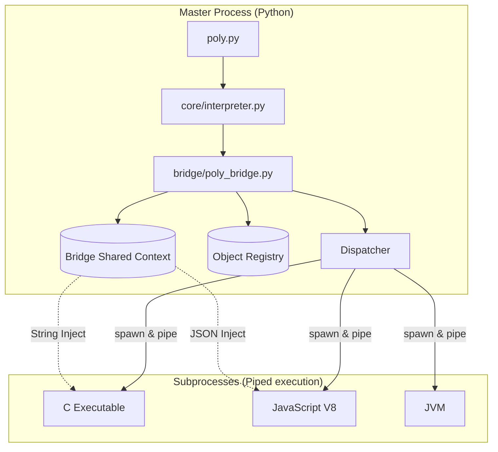
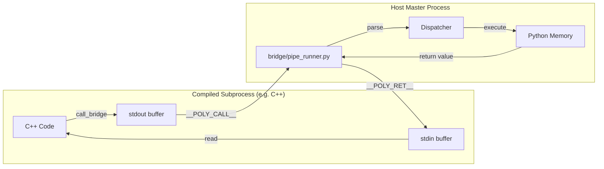
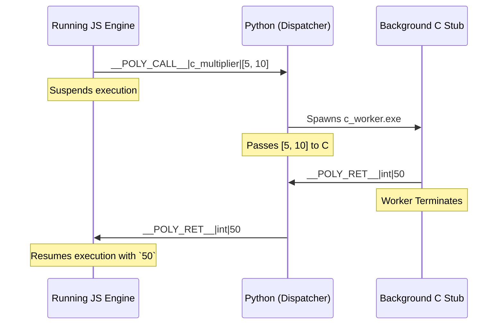
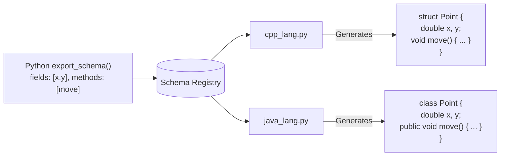

# 🏛️ Polyglot Framework Architecture Reference

This document visualizes the complete inner workings of the Polyglot Framework. These architectural diagrams explain the exact data flow, memory mapping, and process management for every core feature.

---

## 1. Top-Level Process Architecture (The Bird's Eye View)

The framework runs as a single **Master Python Process** that launches and orchestrates multiple **Child Subprocesses** over standard IO.



---

## 2. Feature: Unidirectional Memory Sharing (Phase 2 Variable Injection)

How do primitive variables (like `x = 10`) move from Python into C or JavaScript? They do not share RAM. The bridge *generates source code* on the fly.

```mermaid
sequenceDiagram
    participant User as user script (.poly)
    participant Core as core/interpreter.py
    participant Mem as core/context.py
    participant C as C Compiler (c_lang.py)

    User->>Core: global { x = 10 }
    Core->>Mem: Store {"x": 10}
    
    User->>Core: c { printf("%d", x); }
    Core->>Mem: Fetch {"x": 10}
    
    Note right of C: The Python Bridge dynamically<br/>prepends `#define x 10` before compiling!
    
    Core->>C: Compile: "#define x 10 \n printf..."
    C->>User: stdout: "10"
```

---

## 3. Feature: The Interactive Pipe Protocol (Live Function Calling)

This is the cornerstone of Phase 3. It allows languages to interact *after* they have been compiled and are actively running.



---

## 4. Feature: Recursive Stub Architecture (Vice-Versa Function Routing)

When JavaScript wants to call a block of C code, the Python bridge acts as the middleman (router). It dynamically spins up a one-shot worker of the target language.



---

## 5. Feature: Global OOP & Methods (Phase 3E Object Proxies)

How do you pass a customized Python `class` to Java and let Java invoke its methods natively? 
Using **Integer Handle IDs** mapped to auto-generated Proxy Code.

```mermaid
flowchart TD
    subgraph PythonMaster["Python Master"]
        PyObj[Python 'Counter' Instance]
        Store[(Object Store)]
        PyObj <--> |Assigned Handle: #4| Store
    end

    Store --> |"Exports Schema & Handle #4"| Java_Compiler

    subgraph JavaProcess["Java Process"]
        Java_Compiler --> |"Generates Native Class"| Proxy[Java 'Counter' Proxy]
        Proxy --> |"Holds local variable handle=4"| Logic
        
        Logic[Java App calls: counter.increment()] --> |"Routes request"| MethodPipe
        MethodPipe[Emit: __POLY_METHOD__|4|increment]
    end

    MethodPipe --> |"Intercepted by Python"| Store
    Store --> |"Triggers PyObj.increment()"| PyObj
```

---

## 6. Feature: Class Schema Code-Generation

Before the object handle is passed, the target language must perfectly replicate the class blueprint so it knows what methods exist. PolyBridge acts as a transpiler for schemas.


