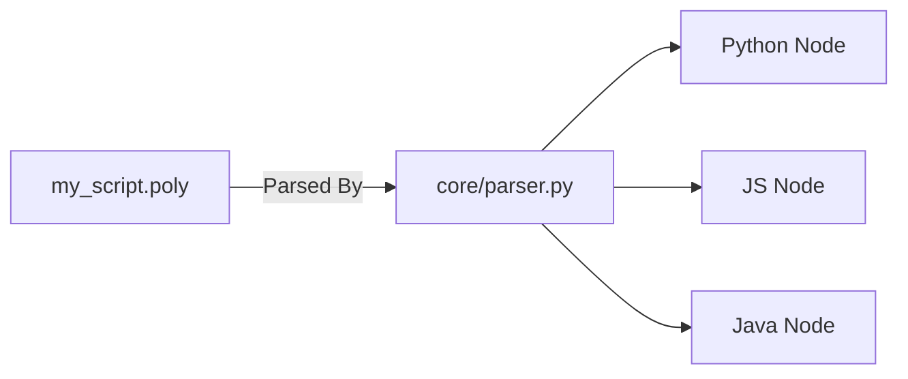
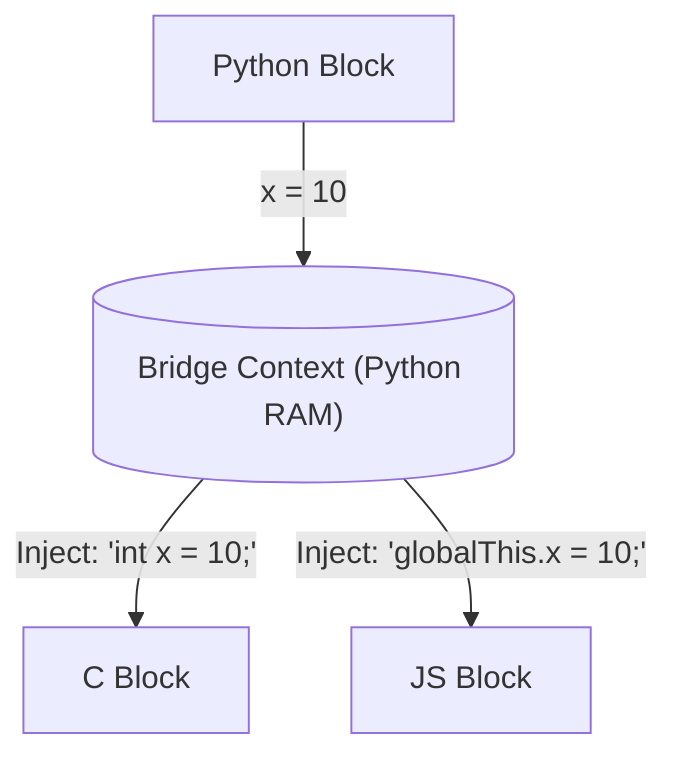
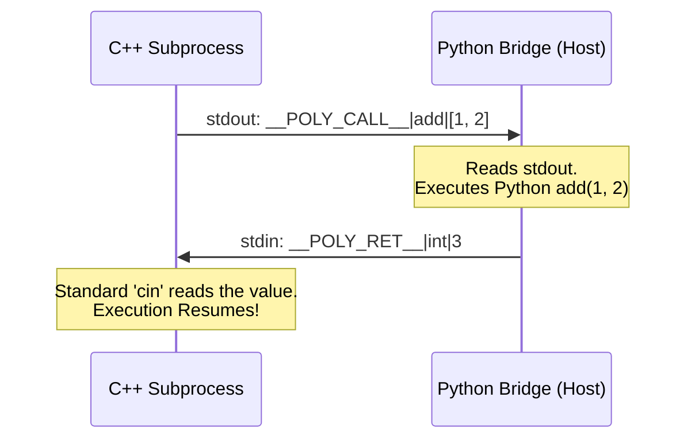
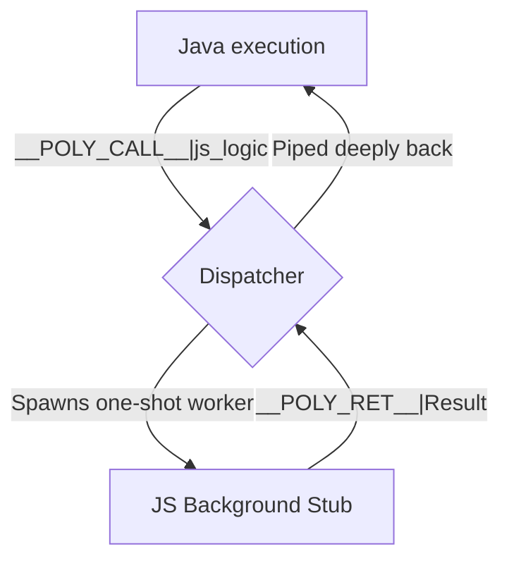
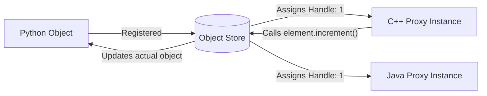

# 🌐 Polyglot Runtime Framework (The Universal Bridge)

Welcome to the Polyglot Runtime Framework! This project allows you to seamlessly intertwine **Python, JavaScript, C, Java, and C++** code inside a single `.poly` file. 

But it’s much more than just a multi-language script runner. It features a **Universal Memory and Function Bridge**. This means variables, objects, and functions are completely shared. A loop running in C can call an API written in JavaScript, which modifies an Object residing in Python's memory—all natively, and all in true real-time.

> 📚 **Looking for visual diagrams of how everything works?** 
> Check out the exhaustive [Architecture & Diagrams Guide (ARCHITECTURE.md)](ARCHITECTURE.md) covering all features from IPC parsing to Global OOP methods!

---

## ✨ Features at a Glance

* **Unified Memory:** Define an integer or string in Python, read it in JavaScript, modify it in C.
* **Vice-Versa Calling:** Any language can call a function located in any other language.
* **Global OOP Methods:** Pass an object instance from one language to another and call its methods across the divide.
* **No Heavy JNI:** Everything relies on highly optimized standard I/O pipes rather than complex compiled binary headers.

---

## 🧠 How It Works: The 5 Pillars of Polyglot

Anyone reading this for the first time can easily understand the underlying engineering. We built this up in five distinct phases. Here is exactly how it works under the hood.

### Pillar 1: The `.poly` Parser
When you run `python poly.py my_script.poly`, the central Python coordinator reads the file. The `core/parser.py` slices the file boundaries using the brackets `{ }`.


The `interpreter.py` then takes these nodes and processes them sequentially from top to bottom.

---

### Pillar 2: Global Memory Context (Unidirectional Sharing)
Languages inherently cannot share RAM. V8 (JavaScript) and GCC (C++) run in total isolation. 
To bypass this, PolyBridge uses a central **Context Dictionary**. 

When a language block starts, PolyBridge looks at the variables in its global dictionary, converts them to text (JSON), and dynamically generates code that injects those variables directly into the compiler of the next language.



---

### Pillar 3: Bidirectional `Stdin/Stdout` IPC (Live Calling)
What if C++ wants to call a Python function dynamically, midway through executing? 
Instead of JNI (Java Native Interface) overhead, we use standard operating system **Pipes** (stdin/stdout).

When a language evaluates `call_bridge("func", ...)`, it prints a specific command string (`__POLY_CALL__`) to the console and halts, waiting for the bridge to respond.


This is managed by `bridge/pipe_runner.py`.

---

### Pillar 4: Vice-Versa Routing (Subprocess Stubs)
What if Java wants to call a JavaScript function?
JavaScript can register functions to the Bridge as "Stubs" using `poly_export_function()`. The raw source code is saved. 

When another language requests it, the `Dispatcher` spins up a micro-worker of that language just to execute that logic!


Because these isolated stubs are generated dynamically, they can also make `__POLY_CALL__` requests, allowing for infinite recursive function jumping across all 5 languages simultaneously.

---

### Pillar 5: Global Object Oriented Programming (OOP)
PolyBridge supports crossing class boundaries. Because a C++ struct cannot exist inside the Java Virtual Machine, PolyBridge uses **Memory Handles**.

1. Python exports an object. The `ObjectStore` saves it and gives it `Handle #1`.
2. Automatically, C++ and Java receive dynamically generated proxy classes referencing `Handle #1`.
3. When Java calls `myObj.increment()`, the proxy sends `__POLY_METHOD__|1|increment` to the Python Coordinator, which modifies the live memory.



---

## 📖 Syntax & Usage Examples

### 1. Variables and Global Scope
```c
global {
    shared_value = 100
}

javascript {
    // Read and mutate
    let x = get_global("shared_value") + 50;
    poly_export("js_computed", x);
}

c {
    // Read the strictly typed mutated value
    long long js_val = get_global_i("js_computed");
    printf("Result: %lld\n", js_val);
}
```

### 2. Universal Invocation
```python
python {
    def python_core(val): return val * 2
    export_function("python_core", python_core)
}

java {
    class Main {
        public static void main(String[] args) {
            // Java drives Python!
            long result = (long)call_bridge("python_core", 100);
            System.out.println("Result: " + result);
        }
    }
}
```

---

## 📈 The Development Roadmap (How We Built This)

To appreciate the scale, here is the exact chronological timeline of how the PolyBridge was engineered:

### Phase 1: Sequential Execution
**Goal:** Run disparate code blocks one after the other.
* **How it worked:** The `core/parser.py` slices the file. `core/interpreter.py` passes the raw strings linearly to wrappers like `c_lang.py`, which execute shells (`gcc`, `node`). 
* **Limitations:** Every block was deaf and blind to the others. 
* **Key Files Involved:** `poly.py`, `core/parser.py`, `core/interpreter.py`

### Phase 2: Unidirectional Data Sharing
**Goal:** Pass integers, strings, and structs downstream.
* **How it worked:** We created `core/context.py` to store variables in Python. When `c_lang.py` boots, it reads Context and concatenates `#define` and `int` literals at the very top of the user's C code before compiling it. We added `__POLY_EXPORT__` markers so blocks could pass data back.
* **Key Files Involved:** `core/context.py`, `bridge/pipe_runner.py`

### Phase 3: The Bidirectional Bridge Network
**Goal:** Break the sequential walls to allow live APIs and function calls.
* **How it worked:** `pipe_runner.py` was rebuilt into a bidirectional Stdin/Stdout pump. `poly_bridge.py` exposed live hooks into `Dispatcher.py`. We injected C/C++/Java proxy functions like `call_bridge()` which printed to the console and halted their own processes waiting for the host. 
* **Key Files Involved:** `bridge/poly_bridge.py`, `bridge/dispatcher.py`

### Phase 3 (Update): Remote Stubs & "Vice-Versa" Calling
**Goal:** Allow C++ to call JavaScript.
* **How it worked:** We built `stub_invoker.py`. If C++ requested a JavaScript function, Python spawned a background `Node.js` process exclusively to execute that logic dynamically, intercepting its output and filtering it back locally down to C++.
* **Key Files Involved:** `bridge/registry.py`, `bridge/stub_invoker.py`

### Phase 3E: Global OOP Schema Generation
**Goal:** Maintain living multi-language Class memory states.
* **How it worked:** Added `ObjectStore.py`. When Python defines a User Class, `cpp_lang.py` generates parallel C++ `structs` using String-interpolation templates, wiring every method request across the shell pipelines.
* **Key Files Involved:** `bridge/object_store.py`, `languages/cpp_lang.py`, `languages/java_lang.py`

---

## 📂 Project Structure Directory

```
poly_runtime/
├── poly.py                   # Main entry point CLI
├── bridge/                   # Core Memory and Network Engine
│   ├── poly_bridge.py        # Brain of the system: IPC Router
│   ├── pipe_runner.py        # Bidirectional Stdin/Stdout Manager
│   ├── stub_invoker.py       # Intercepts 'Vice-Versa' languages stubs
│   ├── object_store.py       # Tracks instance memory across borders
│   └── registry.py           # Function map
│
├── core/                     # Syntax Engine
│   ├── parser.py             # Parses { } syntax blocks
│   └── interpreter.py        # Central sequence coordinator
│
└── languages/                # Adapters & Compilers
    ├── python_lang.py        # Extends Python context
    ├── js_lang.py            # Node.js compiler
    ├── c_lang.py             # GCC adapter
    ├── cpp_lang.py           # G++ adapter 
    └── java_lang.py          # JDK adapter
```

## ⚙️ Installation & Running

Ensure you have the required compilers installed on your `PATH`:
- **Python 3.10+** (Master Coordinator)
- **Node.js** (JS execution)
- **GCC / G++** (C and C++ Compilation)
- **Java JDK** (`javac` and `java`)

**To Run Example Suite:**
```bash
python poly.py example/19_universal_vice_versa.poly
```
