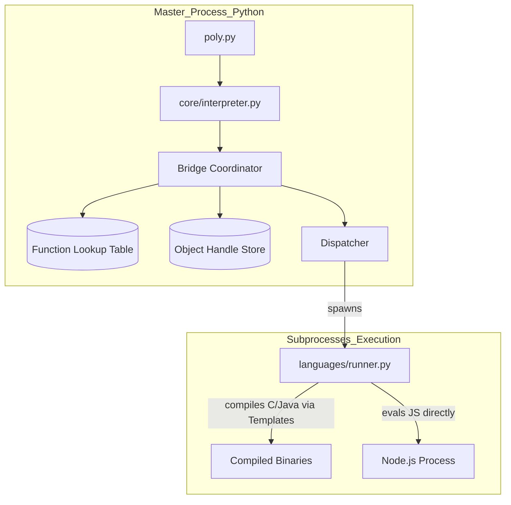
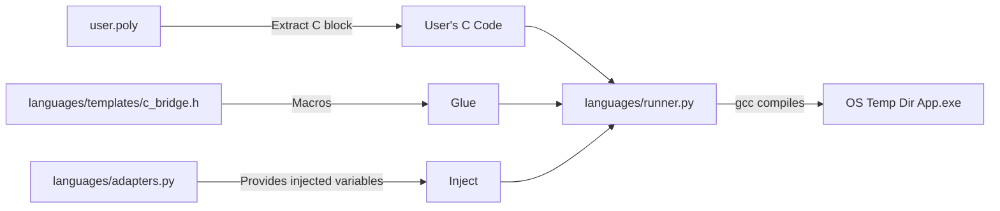
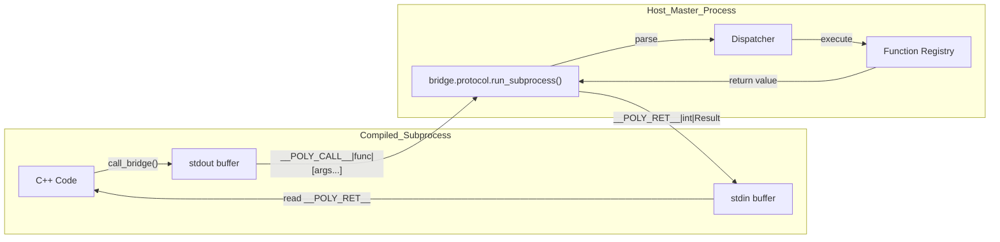
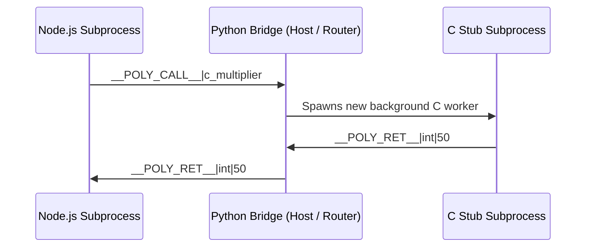
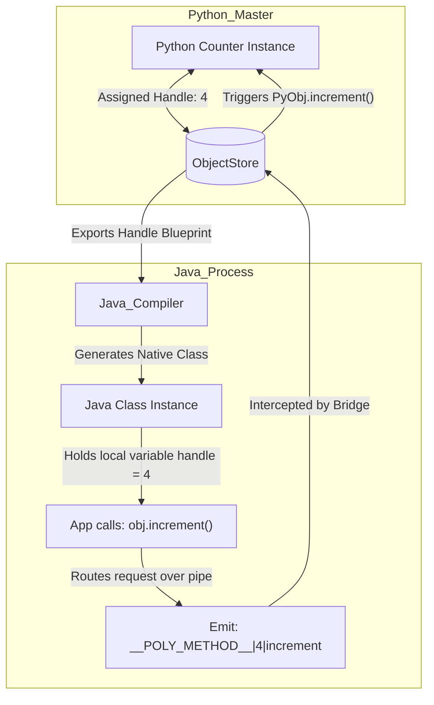

# 🏛️ Polyglot Framework Architecture Reference

Welcome to the **Polyglot Runtime Framework**! This document serves as the complete, beginner-friendly guide to how this "Universal Bridge" works—from the broad concepts down to the actual system architecture, heavily visualized with diagrams.

---

## ✨ What Makes This Special?

Usually, crossing from Python to C++ or Java requires extremely complex bindings (like JNI or PyBind). This framework solves those problems using an elegant, lightweight architecture:

1. **Unified Memory:** Define an integer `x = 10` in Python, read it dynamically in JavaScript, and modify it directly in C.
2. **Vice-Versa Calling:** A loop running in C can pause, natively call an API written in JavaScript, execute it, get the result, and continue running. 
3. **Global OOP Methods:** Pass an object instance from Python to Java, and let Java call its methods across the language divide using mapped Memory Handles.
4. **Zero Workspace Clutter:** C, C++, and Java blocks are securely compiled in your computer's hidden OS Temp folder. Your project folder stays pristine!

---

## ⚡ A Quick Glimpse of the Magic

Here is what a `.poly` script actually looks like. It flows seamlessly from top to bottom.

```c
global {
    shared_value = 100
}

javascript {
    let x = get_global("shared_value") + 50;
    
    poly_export_function("js_multiplier", function(val) {
        return val * x;
    }, "int");
}

c {
    long long result = call_bridge("js_multiplier", 10);
    printf("C received from JS: %lld\n", result);
}
```

---

## 🧠 How It Works: The 5 Pillars of Architecture

Under the hood, this does not rely on heavy compiled bindings. It relies on a **Template Engine**, a **Central Bridge Router**, and highly optimized **Standard I/O Pipes**. Let's break down exactly how it works with visual diagrams.

### Pillar 1: The Master Python Process (The Bird's Eye View)
When you run `python poly.py my_script.poly`, the Master Python process takes control. The `parser.py` slices the file along the `{...}` brackets. The `interpreter.py` passes these blocks one by one to the `Bridge`.



---

### Pillar 2: The Template Engine (Sharing Variables)
Languages inherently cannot share RAM. V8 (JavaScript) and GCC (C/C++) run in total isolation. 
When a language block starts, how does it know the value of `shared_value`? 

The Bridge looks at the variables in its memory, wraps them up natively, and uses a **Template Engine** to inject them directly into the target language's source code before execution.



---

### Pillar 3: The Interactive Pipe Protocol (Live Function Calling)
What if C++ wants to call a Python function dynamically, midway through executing? 
Instead of heavy JNI overhead, we use standard operating system **Pipes** (stdin/stdout).

When a language evaluates `call_bridge("func", ...)`, it prints a specific command string (`__POLY_CALL__`) to the console and halts, waiting for the host to respond.



---

### Pillar 4: Recursive Vice-Versa Routing 
What if Java wants to call a JavaScript function?
JavaScript can register functions to the Bridge as "Stubs". The raw source code is saved. 

When another language requests it, the Bridge spins up a tiny background micro-worker of that language just to execute that logic!



---

### Pillar 5: Global Object Oriented Programming (OOP)
PolyBridge supports crossing class boundaries. Because a C++ struct cannot physically exist inside the Java Virtual Machine, PolyBridge uses **Memory Handles**.

1. Python creates a `class Counter` and stores it, getting `Handle ID: 4`.
2. Ahead of time, C++ and Java receive auto-generated proxy classes representing that Counter schema.
3. When Java calls `myObj.increment()`, the proxy realizes it is holding `ID: 4` and fires a pipe command to Python: `__POLY_METHOD__|4|increment`. Python updates the live memory.


